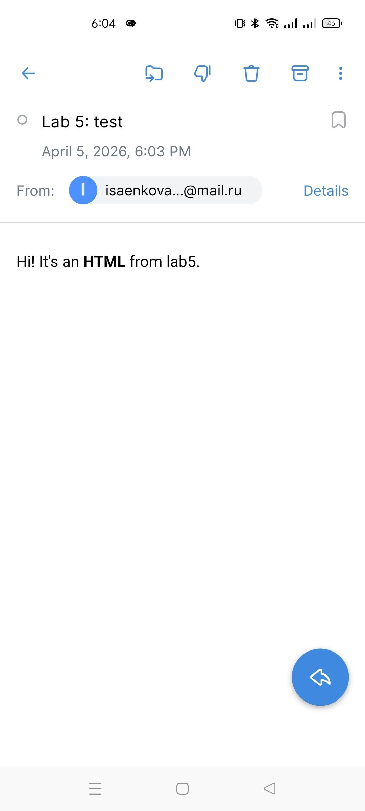
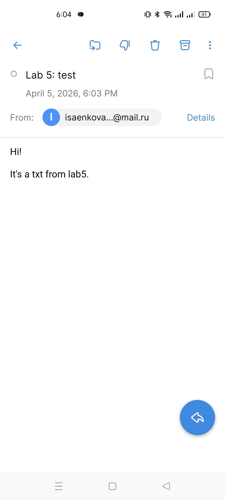
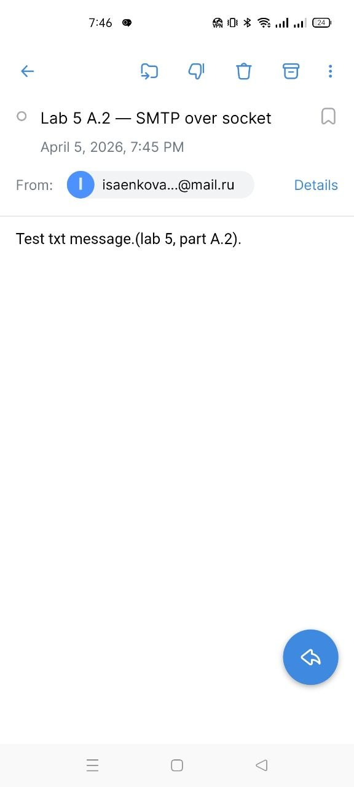
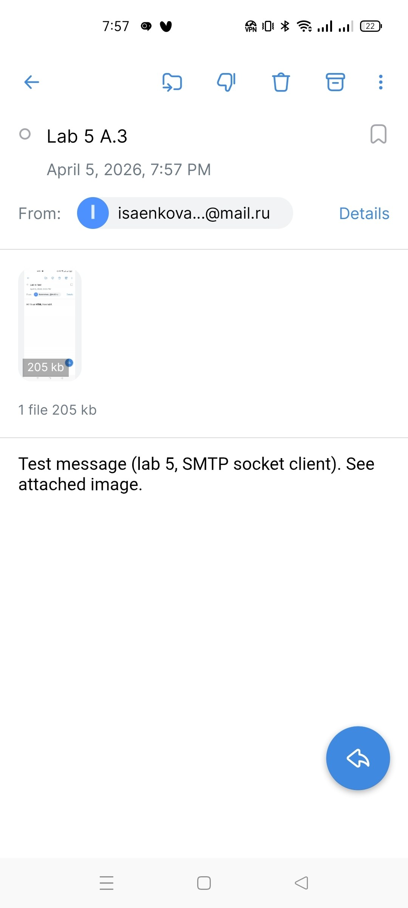
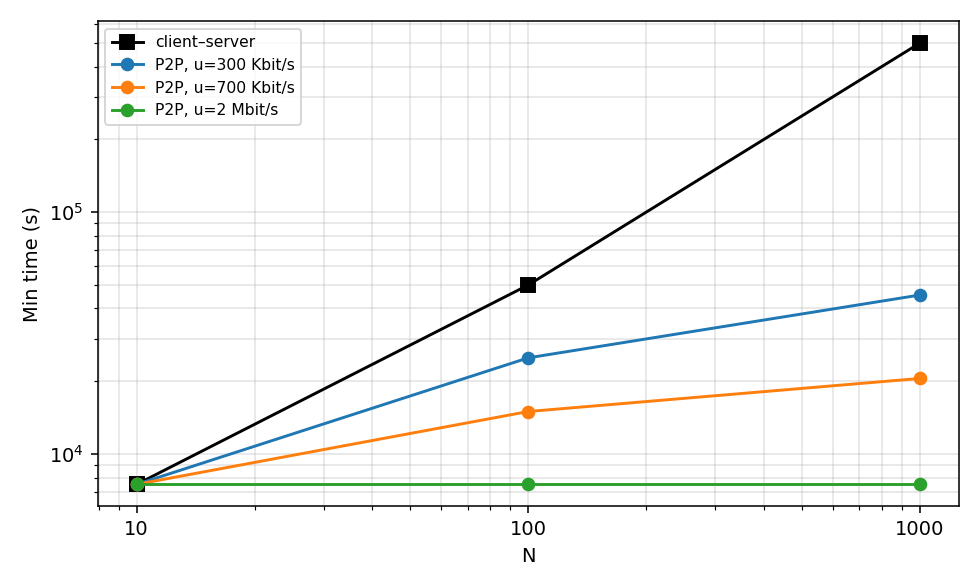

# Практика 5. Прикладной уровень

## Программирование сокетов.

### A. Почта и SMTP (7 баллов)

### 1. Почтовый клиент (2 балла)
Напишите программу для отправки электронной почты получателю, адрес
которого задается параметром. Адрес отправителя может быть постоянным. Программа
должна поддерживать два формата сообщений: **txt** и **html**. Используйте готовые
библиотеки для работы с почтой, т.е. в этом задании **не** предполагается общение с smtp
сервером через сокеты напрямую.

Приложите скриншоты полученных сообщений (для обоих форматов).

#### Демонстрация работы
- 
- 

### 2. SMTP-клиент (3 балла)
Разработайте простой почтовый клиент, который отправляет текстовые сообщения
электронной почты произвольному получателю. Программа должна соединиться с
почтовым сервером, используя протокол SMTP, и передать ему сообщение.
Не используйте встроенные методы для отправки почты, которые есть в большинстве
современных платформ. Вместо этого реализуйте свое решение на сокетах с передачей
сообщений почтовому серверу.

Сделайте скриншоты полученных сообщений.

#### Демонстрация работы

### 3. SMTP-клиент: бинарные данные (2 балла)
Модифицируйте ваш SMTP-клиент из предыдущего задания так, чтобы теперь он мог
отправлять письма с изображениями (бинарными данными).

Сделайте скриншот, подтверждающий получение почтового сообщения с картинкой.

#### Демонстрация работы

---

_Многие почтовые серверы используют ssl, что может вызвать трудности при работе с ними из
ваших приложений. Можете использовать для тестов smtp сервер СПбГУ: mail.spbu.ru, 25_

### Б. Удаленный запуск команд (3 балла)
Напишите программу для запуска команд (или приложений) на удаленном хосте с помощью TCP сокетов.

Например, вы можете с клиента дать команду серверу запустить приложение Калькулятор или
Paint (на стороне сервера). Или запустить консольное приложение/утилиту с указанными
параметрами. Однако запущенное приложение **должно** выводить какую-либо информацию на
консоль или передавать свой статус после запуска, который должен быть отправлен обратно
клиенту. Продемонстрируйте работу вашей программы, приложив скриншот.

Например, удаленно запускается команда `ping yandex.ru`. Результат этой команды (запущенной на
сервере) отправляется обратно клиенту.

#### Демонстрация работы
todo

### В. Широковещательная рассылка через UDP (2 балла)
Реализуйте сервер (веб-службу) и клиента с использованием интерфейса Socket API, которая:
- работает по протоколу UDP
- каждую секунду рассылает широковещательно всем клиентам свое текущее время
- клиент службы выводит на консоль сообщаемое ему время

#### Демонстрация работы
todo

## Задачи

### Задача 1 (2 балла)
Рассмотрим короткую, $10$-метровую линию связи, по которой отправитель может передавать
данные со скоростью $150$ бит/с в обоих направлениях. Предположим, что пакеты, содержащие
данные, имеют размер $100000$ бит, а пакеты, содержащие только управляющую информацию
(например, флаг подтверждения или информацию рукопожатия) – $200$ бит. Предположим, что у
нас $10$ параллельных соединений, и каждому предоставлено $1/10$ полосы пропускания канала
связи. Также допустим, что используется протокол HTTP, и предположим, что каждый
загруженный объект имеет размер $100$ Кбит, и что исходный объект содержит $10$ ссылок на другие
объекты того же отправителя. Будем считать, что скорость распространения сигнала равна
скорости света ($300 \cdot 10^6$ м/с).
1. Вычислите общее время, необходимое для получения всех объектов при параллельных
непостоянных HTTP-соединениях
2. Вычислите общее время для постоянных HTTP-соединений. Ожидается ли существенное
преимущество по сравнению со случаем непостоянного соединения?

#### Решение
- каждое соединение получает 1/10 полосы => 150/10 = 15 бит/с
- передача управляющего пакета: 200/15 $\approx$ 13.3 с
- передача пакета данных: 100000/15 $\approx$ 6666.7 с
- установка TCP соединения: 3 * 13.(3) = 40 с
- передача одного объекта с установкой соединения: 2 * 13.(3) + 6666.(6) + 40 = 6733.(3) с.
- без соединения на 40 сек меньше.

1. 
- сначала базовый объект на одном соединении: 6733.(3) с
- после получения базового узнаём ещё о 10 встроенных объектах. Для каждого новое TCP. Все 10 идут параллельно => 6733.(3) с.
- общее время: 2 * 6733.(3) = 13466.(6) c.

2. 
- сначала установим все 10 соединений параллельно: 40 с.
- на одном из соединений загружаем базовый объект: 6693.(3) с
- используем все 10 соединений для параллельной загрузки 10 встроенных объектов. 6693.(3) c.
- итого: 40 + 2*6693.(3) = 13426.(6) c.

- - преимущество 40 с!!

### Задача 2 (3 балла)
Рассмотрим раздачу файла размером $F = 15$ Гбит $N$ пирам. Сервер имеет скорость отдачи $u_s = 30$
Мбит/с, а каждый узел имеет скорость загрузки $d_i = 2$ Мбит/с и скорость отдачи $u$. Для $N = 10$, $100$
и $1000$ и для $u = 300$ Кбит/с, $700$ Кбит/с и $2$ Мбит/с подготовьте график минимального времени
раздачи для всех сочетаний $N$ и $u$ для вариантов клиент-серверной и одноранговой раздачи.

#### Решение

Единицы: **F = 15 000** Мбит, **u_s = 30** Мбит/с, **d = 2** Мбит/с, **u** ∈ {0,3; 0,7; 2} Мбит/с.

$$
D_{\mathrm{cs}} = \max\left(\frac{NF}{u_s},\,\frac{F}{d}\right) = \max(500N,\,7500)\ \text{с}
$$

$$
D_{\mathrm{p2p}} = \max\left(\frac{F}{u_s},\,\frac{F}{d},\,\frac{NF}{u_s + Nu}\right)
$$

| N | CS, с | P2P, u=300 кбит/с | P2P, u=700 кбит/с | P2P, u=2 Мбит/с |
|--:|------:|------------------:|------------------:|----------------:|
| 10 | 7500 | 7500 | 7500 | 7500 |
| 100 | 50000 | 25000 | 15000 | 7500 |
| 1000 | 500000 | 45455 | 20548 | 7500 |

График (логарифмические оси): `python3 plot_task2.py`

### Задача 3 (3 балла)
Рассмотрим клиент-серверную раздачу файла размером $F$ бит $N$ пирам, при которой сервер
способен отдавать одновременно данные множеству пиров – каждому с различной скоростью,
но общая скорость отдачи при этом не превышает значения $u_s$. Схема раздачи непрерывная.
1. Предположим, что $\dfrac{u_s}{N} \le d_{min}$.
   При какой схеме общее время раздачи будет составлять $\dfrac{N F}{u_s}$?
2. Предположим, что $\dfrac{u_s}{N} \ge d_{min}$. 
   При какой схеме общее время раздачи будет составлять  $\dfrac{F}{d_{min}}$?
3. Докажите, что минимальное время раздачи описывается формулой $\max\left(\dfrac{N F}{u_s}, \dfrac{F}{d_{min}}\right)$?

#### Решение

Обозначим $d_{\min}$ — минимальная скорость приёма среди пиров. Сервер отдаёт суммарно не быстрее $u_s$; каждый должен получить $F$ бит.

1. Условие $\dfrac{u_s}{N} \le d_{\min}$ эквивалентно $u_s \le N d_{\min}$: узкое место — аплинк сервера (пиры могли бы качать быстрее, но сервер не выдаёт). Непрерывная схема: постоянно загружать сервер на $u_s$, распределяя поток между пирами так, чтобы никто не получал больше своего $d_i$ (достаточно, например, равных долей $u_s/N$ на каждого — они не превышают их $d_i$). Тогда суммарно уходит $NF$ бит со средней скоростью $u_s$, время

$$
T = \frac{NF}{u_s}.
$$

2. Условие $\dfrac{u_s}{N} \ge d_{\min}$ ⇔ $u_s \ge N d_{\min}$: сервер может одновременно подпитывать всех со скоростью не ниже $d_{\min}$. Тогда узкое место — самый медленный приёмник $d_{\min}$. Схема: выделить каждому пиру поток не меньше $d_{\min}$ (и не больше его $d_i$), сервер укладывается в $u_s$. Все заканчивают, когда самый медленный скачает $F$ бит:

$$
T = \frac{F}{d_{\min}}.
$$

3. Снизу: $T \ge \dfrac{NF}{u_s}$ (сервер не может отдать $NF$ бит быстрее) и $T \ge \dfrac{F}{d_{\min}}$ (пир с приёмом $d_{\min}$ не получит $F$ бит быстрее). Значит

$$
T \ge \max\left(\frac{NF}{u_s},\,\frac{F}{d_{\min}}\right).
$$

При п.1 выполнено $\dfrac{u_s}{N} \le d_{\min}$ ⇒ $\dfrac{NF}{u_s} \ge \dfrac{F}{d_{\min}}$ ⇒ максимум равен $\dfrac{NF}{u_s}$ — достигается схемой из п.1. При п.2 наоборот $\dfrac{F}{d_{\min}} \ge \dfrac{NF}{u_s}$ ⇒ максимум равен $\dfrac{F}{d_{\min}}$ — схема из п.2. Итого минимально возможное время

$$
T_{\min} = \max\left(\frac{NF}{u_s},\,\frac{F}{d_{\min}}\right).
$$
